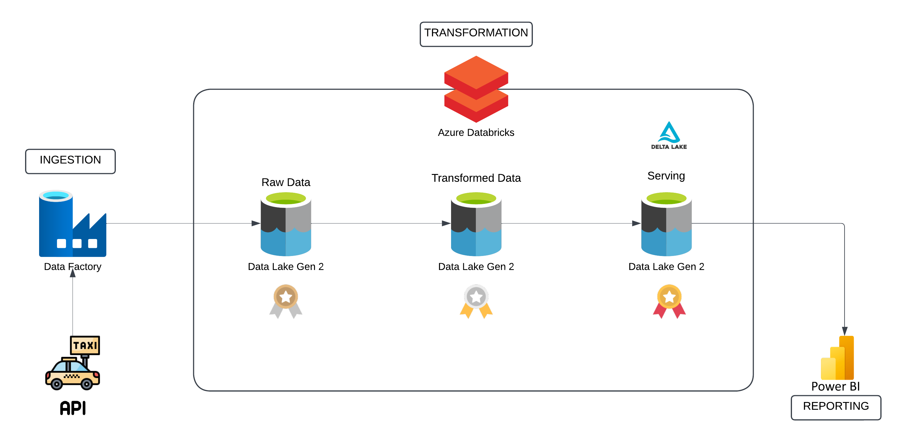

# NYC-Taxi-Data-Engineering-Project

## Overview
This project involves extracting NYC taxi data from an API and storing it in a data lake. The data is transformed using the medallion architecture in Databricks with PySpark, progressing through bronze, silver, and gold layers. Delta tables are created in Azure Data Lake Storage (ADLS) and integrated with Power BI for dynamic visualizations.

## Data Architecture

## Lessons Learned
1. Developed a Parameterized Data Pipeline to extract data dynamically from the website.
2. Enabled Databricks to access ADLS using a service principal for secure, controlled access.
3. Adopted the Medallion Architecture (Bronze, Silver, Gold Layers) for systematic data transformation and enrichment.
4. Established Delta Lake for Efficient Data Storage and created Delta Tables over this data.
5. Leveraged Data Versioning and Time Travel allowing historical data retrieval and rollback capabilities

